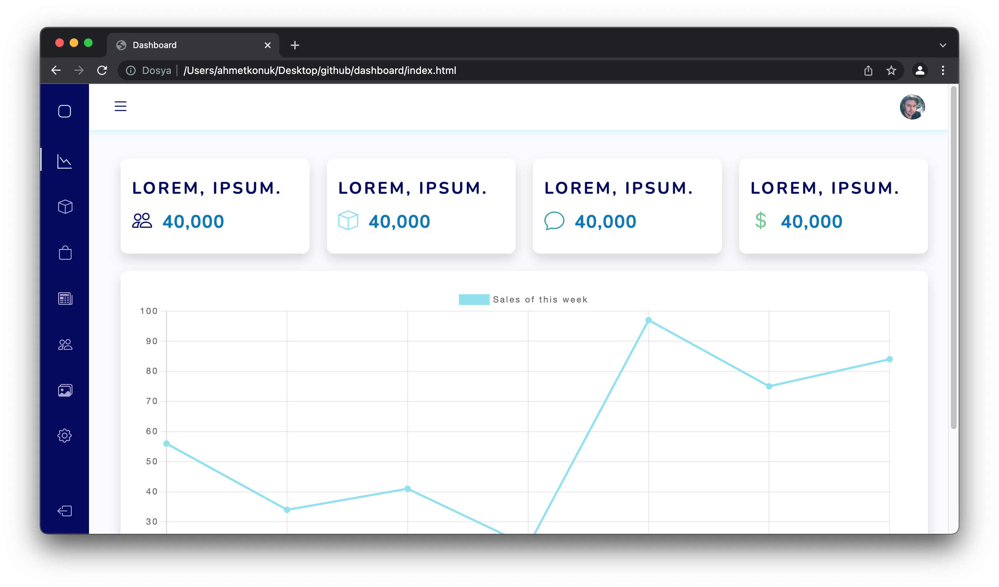

# Bootstrap 5 Responsive Admin Dashboard

If you want to take a look at the project live visit: [Dashboard](https://tender-spence-0c2445.netlify.app/)




## General info

This is a responsive Bootstrap 5 Admin Dashboard with features like;

* Setting column visibility in data tables
* Dynamic search in tables
* Export data tables as CSV, Excel, PDF format
* One click print data tables
* One click copy all data table informations
* Dynamic sorting of rows in data tables
* Drag & Drop multiple images

## Technologies

Project is created with;

* Bootstrap 5.1.3
* Bootstrap Icons 1.8.0
* Chart.js 3.7.0
* Jquery 3.5.1
* Jquery UI 1.13.1
* Datatables 2.2.2
* Dropzone JS

## Cloning the Project

```bash
git clone https://github.com/ahmetdogukankonuk/dashboard.git
```